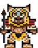
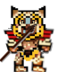
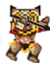
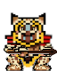

# Dreams of a Jaguar 
Ancient Mayan themed side-scrolling video game with a twist: All of the enemy units are dynamically generated via Stable Diffusion!

**Final project for Harvard edX CS50P ending Dec. 30, 2022.**

#### Video Demo: <URL_HERE>

## Description:
Try to survive as long as possible by jumping over, crouching under, and/or attacking enemy units. 

### Controls ###
- Jump - ```UP```
- Crouch - ```DOWN```
- Forward - ```RIGHT```
- Backward - ```LEFT```
- Attack - ```SPACE```
- Save & Exit - ```ESCAPE```

## Features ##
- Create endlessly unique enemy units using Stable Diffusion A.I.
    - Just click a unit on the main screen to generate a new one
    - requires API KEY from [replicate.com](https://replicate.com)


- Pressing ```ESCAPE``` during gameplay will save your game and exit. The next time you run the game your previous game will be restored for you to continue playing. 

- An overall high score is also maintained

- There may also be a hidden easter egg or two... ;)

## Regular Mode ##
Uses only out of the box / baked-in enemy units. These units were created via Stable Diffusion in **Dream Mode** and then saved. Enemy units in **Regular Mode** are static and cannot be changed.
```
pip install pygame
pip install pillow
python project.py
```

## _Dream_ Mode ##
Unlock ability to dynamically generate new enemy units via Stable Diffusion
<br>**requires API KEY from [replicate.com](https://replicate.com)
```
pip install pygame
pip install pillow
pip install replicate
export REPLICATE_API_TOKEN=<api_key>
python project.py --dream
```
This will launch the game and generate six all-new enemy units, replacing any previously generated units in the process.

To launch the game using the previously generated units, just run:
```
python project.py
```


## Project structure:

The project is oprganized as follows:
- ```project.py``` - the main python file you need to execute to run the game.
- ```game.py``` - ```Game``` class responsible for composing all of the various classes, functions, and capabilities into a cohesive game. 
- ```player.py``` - ```Player``` class responsible for encapsulating all of the player-related attributes and logic.
- ```enemy.py``` - ```Enemy``` class responsible for encapsulating all of the enemy-related attributes and logic.
- ```main_screen.py``` -  ```MainScreen``` class responsible for encapsulating all of the main screen related attributes and logic.
- ```config.py``` - configuration constants such as gravity, screen size, player velocity, etc.
- ```test_project.py``` - tests for verifying everything in ```project.py``` are working as expected.
- ```README.md``` - **You are here**
- ```requirements.txt``` - list of pip libraries required
- ```audio/``` - directory containing all of the sound and music assets for the game
- ```graphics/``` - directory containing all of the graphical assets for the game
- ```stable-diffusion/``` - directory containing all of the stable diffusion related files and assets. Explained in further detail below.

## Baked-In Game Assets ##
We utlilized [midjourney](https://www.midjourney.com/home/) & [Dall-E 2](https://openai.com/dall-e-2/) to help generate a lot of the visual assets used in the game. 

### Player Character ###
The main player character was generated via [Dall-E 2](https://openai.com/dall-e-2/) with th prompt: ```Ancient Mayan Jaguar Chaac God 16-bit style```.

Using Gimp, we then manually created all of the character image variations including: stand, walk, attack, jump, jump-attack, crouch, and just for fun, crouch-attack :)

<div>
    
    
    
</div>
<div>
    
    
</div>
<div>
    
    
</div>
<br><br>

### Background Layers ###

The parallax scrolling background assets were obtained from:<br> https://gameartpartners.com/downloads/mayan-temple-game-background/

### Audio ###
Music and sound effects were obtained from various free gaming content websites, such as: [freesound.org](freesound.org), [pixabay.com](pixabay.com), and [chosic.com](chosic.com).

- [Asset attributions below](#ca)

## Enemy Units

All enemy units in Dreams of a Jaguar are created from a single image "sprite" containing 4 frames of the same creature arranged in a 2x2 grid such that displaying them in sequence would produce an animation. Here is a hi-res example of a single enemy unit sprite containing 4 frames: 


<br><br>

When an ```EnemyUnit``` class is intantiated, the \__init__ method loads the corresponding image sprite and splits it up into a list of 4 smaller images representing each frame.

To animate the frames, the variable ```animation_index``` is used to track which frame to draw. This variable is incremented by ```0.1``` on every iteration of the game loop, and is then passed to ```int()``` to determine which frame to show. This means, we'll get frame ```0``` for ten iterations, then frame ```1``` for ten iterations, and so on until we get to frame ```9``` and start back over at ```0``` again. Adjusting this constant changes the speed of the animation.

#### Collisions ####
A pygame ```mask``` is used for colision detection. Using a mask allows you to detect if any of the player's non-transparent pixels are touching any of the enemy's non-transparent pixels. Each frame uses a separate mask, as the transparent part is different in each frame.

## "Dreaming" up new units with Stable Diffusion
To dynamically generate random creates/units that look at least _somewhat_ feasible when animated, we are leveraging several techniques. Careful and tedious "prompt engineering" among the most important. We also use an ```init_image```, to provide Stable Diffusion with a visual example of what we're looking for. These images are found in the ```/stable-diffusion/init_image``` folder.

The 2x2 grid format has so far produced the best results. Attempting to create multiple frames for the same creature as separate requests would rarely produce images able to be animated in sequence. Perhaps there is a better way we have yet to discover. However, combining all of the frames into a single image actually works surprisingly well. That is, in conjuction with the highly curated text prompt and other settings. When all of these parameters are adjusted just right, it can produce some really cool results!

## Stable Diuffusion Integration ##
Initially we wanted to install and run Stable Diffusion locally along side our game so that everything was being ran locally. However, this approach presented several challenges:

- Intel Mac vs M1 Mac vs PC installation & command line differences
- GPU vs CPU availability
- very large model/checkpoint files (5+ GB)
- Model speed differences on different hardware
- Multiple forks and rapidly evolving codebase

While still an intruging idea that we will undoubtably continue to pursue, we decided it was out of scope for this project. Instead, we opted to use a readily available web API (replicate.com), which greatly simplified integration and would ensure compatibility no matter what type of computer was running it. As long as it has internet access and can run Python, you should be good to go. All you need is an API KEY from replicate.com.

#### Player Involvement ####
 With all that said, our approach is still unpredictable and can often generate undesirable results. To address this, we decided to let the player interact with Stable Diffusion on the main screen directly by allowing them to click on either a specific unit, or the player chatacter in the center to regenerate either a specific unit, or all the units, respectfully. The player can repeat this process until they like all of their units, and/or are free to explore and keep generating more just for fun! Regenerating units can take around 30 seconds to a minute, depending on internet speed and server.

## Game Concept and Development Process ##
We brainstormed quite a few different ideas before finally settling on a game. At first, all we knew was that we wanted it to be ancient Mayan themed and utilize machine learning / A.I. in some novel and fun way.

YouTube has a ton of great pygame tutorials and after watching a bunch we decided to create a super simple side-scrolling "flappy-bird" style game.

Around the same time we were also heavily experimenting with Dall-E 2, Mid Journey, and Stable Diffusion for producing A.I. generated art from simple text prompts. We decided to use these models to help us create some of our game assets. Specifically:

- The main player character was generated by Dall-E 2 and then hand-edited in Gimp to create all of the needed frames for the animtations.
- The background on the main screen that pans back & forth was generated by Mid Journey.

We managed to get stable-diffusion running on our local machines so we could create more game art and realized it would be super cool to embed stable-diffusion directly in our game and use it to generate content dynamically! After all, they are both Python! However, due to reasons outlined above, we opted for a web API for simplicity.

To enable "Dream Mode", simply sign-up for a replicate.com account and get an API KEY. Be aware it is not free to use, but the cost is minimal if you don't go too crazy. Once you have an API KEY, run the following:

```
export REPLICATE_API_TOKEN=<api_key>
python project.py --dream
```

or

```
python project.py --dream <api_key>
```

If this is the first time running in Dream Mode, the game will automatically "dream" up 6 new unique enemy units, 3 flying units, 3 ground units. This process can take a minute depending on internet speed. Once complete, the enemy units will be displayed on the main screen. The player can then click on a unit to replace that one with a newly generated unit.

Once you like all of the units that are currently displayed, simply press ```SPACE``` to start a game with the units you just created!

## Background Animations ##
The Main screen background was generated via Midjourney.

We discussed several ideas for the game background when actually playing, and decided to go with a parallax scrolling background because we found some great assets that fit our needs, and because parallax scrolling soun ded like a lot of fun to learn. This was very satisfying to implement and to see working!

## Gameplay ##
The game started out as a simple "flappy-bird"-style game where you just jump over enemies. However, we added additional gameplay functionality to make the game a bit more fun. This includes the ability to move forwards & backwards, crouching, and attacking. We also added attack effects, sounds, high score, game persitence, and various other little tweaks :)

## Asset Attibution...
<a name="ca"></a>
- [Background Track](audio/legend-of-narmer.mp3):  
The Legend of Narmer by WombatNoisesAudio | https://soundcloud.com/user-734462061
Creative Commons Attribution 3.0 Unported License
https://creativecommons.org/licenses/by/3.0/
Music promoted by https://www.chosic.com/free-music/all/
